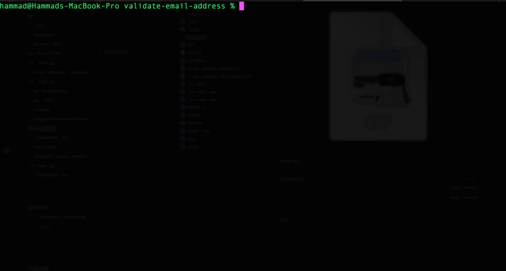

# Email Validation Tool 📧✅

## DEMO



## Overview

This repository contains a Go-based email validation tool. The tool validates email addresses in multiple stages:
1. **Format Validation**: Ensures the email has a valid format.
2. **Domain Validation**: Checks the domain's DNS records, including MX, SPF, and DMARC.
3. **SMTP Validation**: Connects to the domain's mail server to verify the email address.

This program provides robust email validation, making it ideal for developers looking to verify email addresses before processing them further.

---

## Features

- **Regex Validation**: Validates email format using regular expressions.
- **DNS Record Validation**:
  - Checks for MX (Mail Exchange) records.
  - Verifies SPF (Sender Policy Framework) and DMARC (Domain-based Message Authentication, Reporting, and Conformance) records.
- **SMTP Validation**: Performs handshake with mail servers to verify the email address exists.
- **Interactive Input**: Enter email addresses one by one for validation.
- **Detailed Results**: Prints detailed information about the email's domain and validation results.

---

## Installation

1. Clone the repository:
   ```bash
   git clone https://github.com/yourusername/email-validation-tool.git
   ```
2. Move to project directory:
   ```bash
   cd email-validation-tool
   ```
3. Run main file:
   ```bash
   go run main.go
